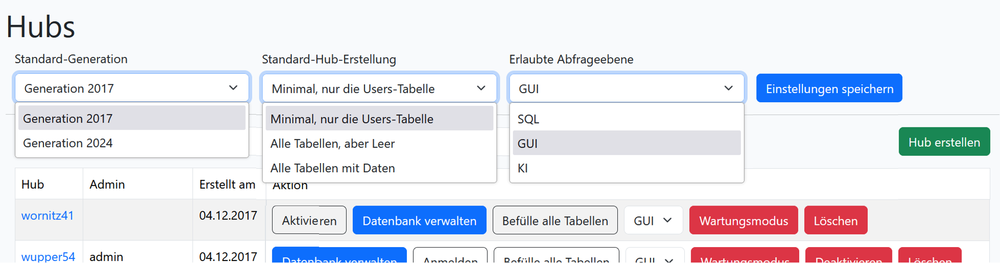
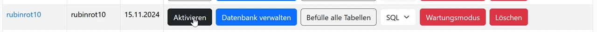
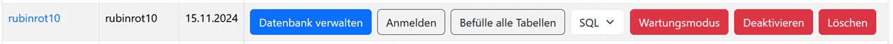
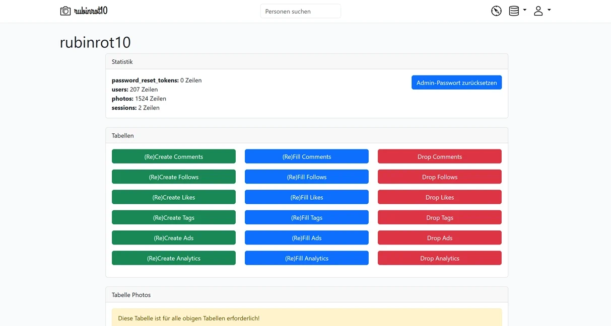

# Administration

## Registrierung

Um sich als Lehrer zu registrieren, muss ein Account angelegt werden. Dabei ist es wichtig, dass die Emailadresse stimmt, da sonst kein Account geprüft und angelegt werden kann. 

Um einen Lehreraccount zu aktivieren, kannst du entweder gleich deine Schulmailadresse verwenden oder du [sendest](https://wi-wissen.de/contact.php) mir einen anderen geeigneten Nachweis mit Angabe deines Benutzernamen. Das ist wichtig, dass nur volljährige Lehrer Schüler administrieren können und auf die Einhaltung der Regelungen achten.

Ein InstaHub kann nur angelegt werden, wenn dieser einem Lehrer zugeordnet wird. So ist sichergestellt, dass zum einen unter fachkundiger Anleitung ein Lernerfolg erzielt werden kann. 

Wurde einer Lehrkraft ein InstaHub zugeordnet, so muss dieser ebenfalls erst aktiviert werden. Dies kann durch die Lehrkraft selbst durchgeführt werden.

  <iframe
  src="https://player.schule/youtube/TKf7slf2K2M?embed=1"
  style="width:100%; aspect-ratio: 1280/720"
  frameborder="0" allow="autoplay; fullscreen; picture-in-picture" allowfullscreen allowTransparency
  ></iframe>

<figcaption>Video aus Online-Workshop bei <a href="https://youtu.be/TKf7slf2K2M">YouTube</a> ansehen </figcaption>

## Grundeinstellungen

Je nach Anwendungsfall lassen sich verschiedene Grundeinstellungen, die für alle neuen Hubs gelten durchgeführt werden:

### Standard-Generation

Für bestehende Lehrmaterialien kann hier noch der ursprüngliche Datensatz von 2017 ausgewählt werden.

* Generation 2017 – Originaler großer unzusammenhängender Datensatz
* Generation 2024 – zusammenhängender KI-Datensatz mit Mustern, 

### Standard-Hub-Erstellung

Hier wird festgelegt, ob der Hub zu Beginn leer oder schon (teilweise) gefüllt sein soll.

* Minimal, nur die User-Tabelle – Ideal für Datenbankzentrierten Unterricht
* Alle Tabellen, aber Leer – Ideal für Planspiele in geschützter Umgebung 
* Alle Tabellen mit Daten – Ideal für Datenmanagement

### Erlaubte Abfrageebene

Je nach Lernziel, kann das Schreiben von SQL, das Verstehen von SQL oder das Auswerten von Daten ermöglicht werden.

::: info
Aktuell sponsort [schulKI.de](https://schulki.de/) für alle Lehrkräfte ein Grundbudget an KI-Token. Sobald dieses verbraucht ist, steht die KI-Funktion nicht mehr zur Verfügung.
:::

* SQL – Ideal für Datenbankunterricht, zeigt Datenbankfehler direkt an.
* GUI – Graphische Oberfläche für SQL-ähnliche Anfragen
* KI – Abfragen in natürlicher Sprache, erklärt zusätzlich SQL-Fehler

## Verwaltung der InstaHubs

Zuerst muss jeder Hub einmalig manuell aktiviert werden.

Nach dem erfolgreichen Login mit einem Lehrer Account wird eine List mit allen zugeordneten Hubs angezeigt. Folgende Aktionen sind möglich:

* Datenbank verwalten – Dashboard des Hubs
* Anmelden– Als admin ohne Passwort einloggen
* Befülle alle Tabellen – Hub vollständig aufbauen
* SQL/GUI/KI – Legt fest, welche Datenbankzugriffe erlaubt sind. GUI schließt SQL mit ein und KI schließt SQL und GUI mit ein. KI erklärt automatisch SQL-Fehlermeldungen im SQL-Editor 
* Wartungsmodus – Hub kann nur noch lesend genutzt werden, Ausnahme ist die Tabelle analytics
* Deaktivieren – Hub kann nicht mehr verwendet werden
* Löschen – Hub wird unwiderruflich gelöscht

## Verwaltung eines InstaHubs

Im oberen Bereich werden alle aktuell verfügbaren Tabellen mit der Anzahl aller Einträge angezeigt. Auch kannst du das Passwort für den Admin-Zugang zurücksetzen.

Darunter befinden sich kopiert alle Tabellen es sind jeweils folgende Aktionen möglich:

* (Re)Create - Hierdurch wird die Tabelle ohne Einträge neu angelegt.
* (Re)Fill - Hierdurch wird die Tabelle mit Dummyeinträgen neu angelegt
* Drop - Hier drüber wird die Tabelle vollständig gelöscht.

Üblicherweise ist diese Hilfestellung Für Schüler notwendig, die einen Fehler gemacht haben, nicht mitgekommen sind oder krank waren.

Sicher ist Ihnen schon aufgefallen, dass das Löschen etwa der Tabelle `Photo` kritisch sein sollte, da dadurch ja etwa die darauf aufbauende Tabelle `Like` ebenfalls gelöscht werden sollte. Dies wird hier aber absichtlich unterbunden, indem das Ausführen von Constraints ausgesetzt wird. 

Dadurch ist es möglich auch zu einem späteren Zeitpunkt die Tabelle `Photo` neu aufzubauen, ohne dass bisherige Errungenschaften in den darauf aufbauenden Tabellen vernichtet werden. Natürlich können dadurch Inkonsistenzen in der Datenbank entstehen, welche aber nicht zu einem Absturz des Systems führen werden. Ist es dennoch notwendig diese Inkonsistenzen aufzulösen, so kann dies entweder manuell geschehen oder die abhängigen Tabellen werden ebenfalls neu aufgebaut.

