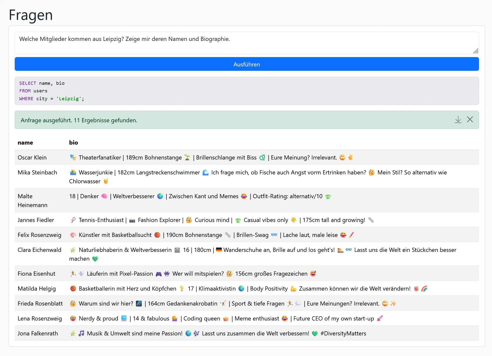

# Datenbank

Hier findet die eigentliche Besonderheit des eigenen InstaHubs statt: Es ist möglich mit die Datenbank nach Belieben zu verändern. Ergebnisse werden dabei in einer Übersicht präsentiert und können auf Wunsch für weitere Auswertungen direkt als CSV heruntergeladen werden.

## KI

::: info
Aktuell sponsort [schulKI.de](https://schulki.de/) für alle Lehrkräfte ein Grundbudget an KI-Token. Sobald dieses verbraucht ist, steht die KI-Funktion nicht mehr zur Verfügung.
:::

Wenn Abfragen nur ein Teil des Datenmanagements sein sollen, dann lässt sich jeder Hub in natürlicher Sprache abfragen:

## GUI

Für Schüler, die SQL lesen lernen sollen und logische Operatoren anwenden sollen, steht ein graphischer Abfrage-Editor zur Verfügung:

In diesem Editor lassen sich zum Lernen auch der erzeugte SQL-Befehl anzeigen.

## SQL

Mit SQL gibt es einen vollständigen Zugriff auf die Datenbank. Lesen, Schreiben und Löschen ist möglich:

Am Ende wird immer die Datenbankstruktur dargestellt.

Da jeder Hub seine eigene Datebank hat, können hierüber tatsächlich alle SQL-Befehle abgesendet werden. Auch das Löschen der eigenen `User`-Tabelle ist möglich. `SELECT`-Abfragen liefern das Ergebnis in einer Tabelle zurück. Andere Abfragen, ob sie erfolgreich ausgeführt wurden, oder welcher Fehler aufgetreten ist. Dabei wird immer der von MySQL gemeldete Fehler zurückgegeben.

