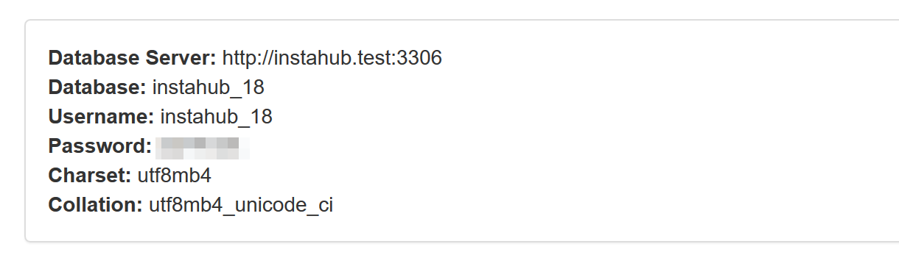

# Didaktik

## Ansätze

Es bieten sich folgende grundsätzliche didaktische Ansätze an:

* Auswerten und Modellieren von Datenbanken
* Datenschutz und -sicherheit
* Perspektivenwechsel: Rolle des Administrator und Werbekunden eines sozialen Netzwerks

### Auswerten und Modellieren von Datenbanken 

#### [Julian Dorn](https://wi-wissen.de/)

Dieser didaktische Ansatz wurde vom Autor bereits mit über 200 SchülerInnen erfolgreich durchgeführt. Es lässt sich damit nach dem sächsischen Lehrplan Informatik der gesamte Lernbereich Datenbanken in der Sekundarstufe II behandeln. Hier erlernen SchülerInnen Fähigkeiten im Modellieren (ERM, Kardinalitäten, Schlüssel etc.) und im Umgang mit SQL (CRUD-Abfragen in einer und verknüpften Tabellen, sowie Anlagen von Tabellen).

**Den Ablaufplan findest du unter [Modellierung und SQL](                        didactic-modellierung-sql)**

**Alle Aufgaben findest du vollständig unter [Übungen](exercices)**

Das Material steht (wie auch diese Dokumentation) unter der [CC BY-NC-SA Lizenz](https://creativecommons.org/licenses/by-nc-sa/4.0/).

#### [Anja Eckstein](http://www.hans-sachs-gymnasium.de/joomla3/index.php)

Für den Informatikunterricht in der 9. Klasse hat Anja Eckstein vom [Hans-Sachs-Gymnasium](http://www.hans-sachs-gymnasium.de/) in Nürnberg Unterrichtsmaterial für 5 Doppelstunden mit Präsentation
und Arbeitsblättern erstellt. Es wird mit Ausnahme der Themen n:m-Beziehungen und zugehörige Abfragen der vollständige bayrische Lehrplan abgedeckt.

**Präsentation und Aufgabenblätter (als PDF und DOCX/PPTX) findest du im [OneDrive](https://1drv.ms/f/s!AmAMmF4kxDW25iEKrhE5WlfBTDWl)**

Das Material steht unter der [CC BY-SA Lizenz](https://creativecommons.org/licenses/by-sa/4.0/).

#### [Reinhard Nitzsche](https://twitter.com/RNitzsche2)

Für den Unterricht an Berufsoberschulen und Beruflichen Gymnasien hat Reinhard Nitzsche in Elmshorn (Schleswig-Holstein) ein digitales Schulbuch für ein Schulhalbjahr mit 1 Doppelstunde je Woche entwickelt. Es lässt sich auch an allgemeinbildenden Gymnasien in der Sek II  einsetzen.

**Digitales Schulbuch im Browser auf [rnitzsche.github.io](https://rnitzsche.github.io/instahub-doc-de/#/) ansehen.**

**Download als PDF, EPUB und Markdown bei [GitHub](https://github.com/RNitzsche/instahub-doc-de).**

Das Material steht unter der [CC BY-NC Lizenz](https://creativecommons.org/licenses/by-nc/3.0/de/).

### Datenschutz und -sicherheit

SchülerInnen ist oft nicht klar, wie verfügbar ihre persönlichen Daten abgespeichert werden und wie leicht sie gefunden und geclustert werden können. Dies zu erzählen ist das eine, aber tatsächlich alle "Nazis" in einem sozialen Netzwerk zu finden, ist ein sehr nachhaltiges Erlebnis, welches bereits schon zu drastischen Reaktionen geführt hat.

Was passiert wenn mal wieder Nutzerdaten bei einem großen Anbieter verloren gegangen sind? Schaut euch gemeinsam an, wie Passwörter heut gespeichert werden (`bcrypt()` in PHP).

Einen Ansatz für die Klassenstufe 5-6 hat Jan Savelsberg in seiner Masterarbeit **[Weiterentwicklung und Implementierung des Projekts "Instahub" für die Sekundarstufe I mit dem Themenschwerpunkt Datenschutz](https://kola.opus.hbz-nrw.de/frontdoor/index/index/searchtype/authorsearch/author/Jan+Savelsberg/docId/1892/start/0/rows/10)** entwickelt. Ergänzend dazu kann auch noch der graphische Abfrage-Editor verwendet werden.

### Perspektivenwechsel mit Tracking und Werbung

InstaHub kann die Aktivität der Nutzer tracken kann und ihnen individuell zugeschnittene (fiktive) Werbung ausliefert. Endlich ist es für SchülerInnen möglich zu verstehen, wie Werbung und Tracking technisch funktionieren. Sie können so fundiert über die gesellschaftliche Entwicklung diskutieren. Besonders im Rahmen des DSGVO kann hier nüchtern betrachtet werden, was eigentlich passiert.

Diese Funktionalität ist sehr neu. Der Autor wird dies auch erst im Frühjahr ausprobieren können. **Es wäre großartig, wenn du hier didaktische Ideen und ggf. Material mit beitragen könntest.**

### Sortierung und Gewichtung des Newsfeeds

Ganz neu ist hinzugekommen, dass InstaHub den Newsfeed gewichten kann. Dafür wird der Edge Rank und die Affinität zu Inhalten verwendet, so ähnlich wie es auch bei Google und vermutlich auch sozialen Netzwerken wie Instagram verwendet wird.

Implementiert und konzipiert wurde das von [Daniel Steil](https://twitter.com/danistl8). Dokumentiert hat er es in seiner Masterarbeit **[Weiterentwicklung des Newsfeeds von InstaHub und Entwicklung einer Unterrichtsreihe zum Thema „Algorithmen in sozialen Netzwerken“ für die Sekundarstufe II](https://kola.opus.hbz-nrw.de/frontdoor/index/index/start/0/rows/10/sortfield/score/sortorder/desc/searchtype/simple/query/Steil/docId/2013)**. 

## Werkzeuge

Um InstaHub zu benutzen sind keine weiteren Werkzeuge notwendig. Alle Aufgaben lassen sich direkt im Browser mithilfe der Sprache SQL bearbeiten. 

Nun kann es sein, dass SQL nicht Bestandteil des Lehrplans ist oder die Zeit zum Erlernen nicht ausreicht. Hier gibt es zwei Möglichkeiten:

InstaHub ausschließlich über die "reguläre" Administratoroberfläche nutzen. Hier können neben den normalen Aktionen des Nutzers auch fremde Eintrage gelöscht und fremde Nutzerprofile bearbeitet werden. 

InstaHub mithilfe eines externen Werkzeugs wie etwa [Microsoft Access](https://de.wikipedia.org/wiki/Microsoft_Access), [LibreOffice Base](https://de.libreoffice.org/discover/base/) oder [phpMyAdmin](https://de.wikipedia.org/wiki/PhpMyAdmin) verwenden. Alle genannten Werkzeuge können sich mit entfernten Datenbanken verbinden. Damit eine Verbindung möglich ist, muss der InstaHub-Server entsprechend konfiguriert sein:

**Achtung: Dies ist aus Sicherheitsgründen und Ressourcenmangel auf dem offiziellen [InstaHub.org](https://instahub.org/)-Server deaktiviert.**

In der `.env` Konfiguration muss *vor* dem Anlagen der Nutzer `ALLOW_PUBLIC_DB_ACCESS=true` gesetzt werden.  Nun können in der Database-Seite die Verbindungsdaten zum Server ausgelesen werden:

