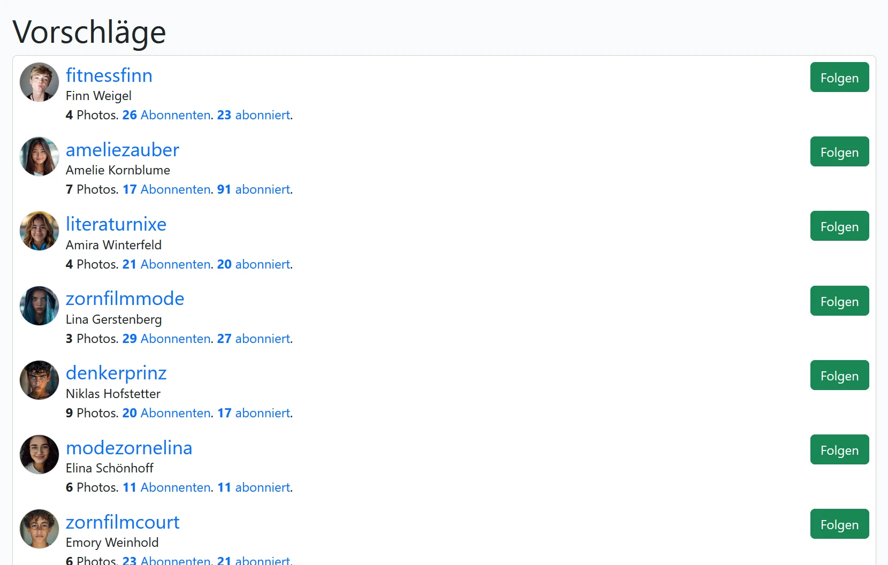

# Empfehlungen

Wie behält man bei mehreren Milliarden Mitgliedern den Überblick? Scrollen wir im Adressbuch oder blättern wie in einem Magazin ist nicht. Hier erfährst du die Lösung.

## Sortierung und Gewichtung des Feeds

InstaHub sortiert auf Wunsch entweder nach den neusten oder den besten Ergebnissen. Im letzteren Fall erhalten Administratoren im Tooltip des jeweiligen Bildes auch das dazugehörige Scoring angezeigt:

### Gewichtung nach Affinität und Aktualität bei Themen-Feeds

Über die Auswahl eines einzelnen Hashtags können Photos zu nur einem Thema betrachtet werden. Das geht etwa über `http://public.instahub.org/tag/natur`. Diese werden bei den besten Ergebnissen nach Affinität und Aktualität sortiert (siehe dazu auch [Kapitel 3.3.2](https://kola.opus.hbz-nrw.de/opus45-kola/frontdoor/deliver/index/docId/2013/file/Masterarbeit.pdf)).

Zusammengefasst passiert Folgendes:

1. Jedes Photo erwählt den Wert `1`
2. Der Wert wird je Kommentar um `2` und je Like um `1` erhöht.
3. Je älter das Photo, desto kleiner der Faktor, mit dem das Ergebnis multipliziert wird (`0,995 ^ (Alter in Sekunden / 900)`. Mindestens aber `0,01`)

Im zweiten Punkt wird versucht, die Wichtigkeit des Photos anhand der Merkmale Anzahl der Likes und Kommentare zu bestimmen. Es wären auch andere Parameter, wie etwa die Anzahl der Aufrufe, die Anzahl von 5-Sternen oder eine inhaltliche Bewertung durch einen Moderator möglich.

Hinweis: Dummy-Photos sind i.d.R. so alt, dass immer mit `0,01` multipliziert wird. Man kann das Datum im Feld `created_at` aktualisieren oder die Schüler\*innen laden eigene Photos hoch, die dann immer am höchsten gewichtet sind.

### Gewichtung nach Edge-Rank im News-Feed

Betrachtet die/der Nutzer\*in den Feed der Personen, denen sie/er folgt, so erscheinen immer die neusten Photos zuerst. Folgt man aber vielen Nutzer\*innen, wäre dies sehr unübersichtlich. Viele Nutzer\*innen bei etwa Facebook oder Instagram kommen nicht dazu jeden Tag alle Neuigkeiten zu betrachten. Daher kann auch hier nach den besten Ergebnissen gewichtet werden (siehe dazu auch [Kapitel 3.3.3](https://kola.opus.hbz-nrw.de/opus45-kola/frontdoor/deliver/index/docId/2013/file/Masterarbeit.pdf)).

Edges (Kanten) sind Interaktionen mit einem Beitrag . Dies sind in diesem Fall weiterhin Likes und Kommentare. Nur werden die Kanten  jeden Beitrages jetzt gewichtet und aufsummiert. Die Gewichtung eines Likes oder Kommentars ist abhängig davon, wer es bzw. ihn vergeben hat. Stammt die Kante von einer/m Nutzer\*in, zu welche/r man selber eine hohe Affinität hat, so erhält der Beitrag auch mehr Punkte:

Die Affinität zu einer/m Nutzer\*in errechnet sich wiederum durch die  Interaktion mit deren Beiträgen. Je mehr Likes und Kommentare man einer/m Nutzer\*in vergibt, desto höher ist die Affinität zu ihm. Die Affinität zu  jedem Nutzer hat initial den Wert `1`. Mit jedem Like, das man einer/m  bestimmten Nutzer\*in gibt, wird der Wert um `1` erhöht. Mit jedem Kommentar  wird er um `2` erhöht. Betrachtet man nun einen speziellen Beitrag, kann dessen Punktzahl berechnet werden, indem für jedes Like der Affinitätswert des Urhebers hinzuaddiert wird. Für die Kommentare wird  ebenso verfahren, nur wird hier der doppelte  Affinitätswert addiert. So erhält jeder Beitrag eine individuelle, vom jeweiligen Nutzer abhängige Punktzahl.

Obiges Vorgehen hat noch den Nachteil, dass einmalig sehr populäre Beiträge bis zum Überbieten ganz oben im Feed stehen würden. So ließe sich etwa bei [YouTube Gangnam Style](https://www.youtube.com/watch?v=9bZkp7q19f0) schwer übertreffen, da der über die Zeit gesammelte Wert so hoch ist. Dennoch hat dieses Video heute nicht mehr die Bedeutung von früher.

Daher beziehen wir die Aktualität mit ein. Dies geschieht durch eine Multiplikation mit einem  Wert zwischen `1` (ganz neu) und `0,01` (sehr alt). Die Berechnung der Aktualität erfolgt mit der Formel: `t(x)= 0,995 ^ (x / 900)` , wobei `x` in  Viertelstunden angegeben ist (`x=1` entspricht 15 Minuten, usw.). Der Aktualitätswert von `0,01` bildet allerdings das Minimum.

## Interessante Profile finden

Wem folgen? Auf einer Party kann man sich gut umschauen, aber was mache ich bei 1,3 Milliarden Mitgliedern auf der Party? Hier sind intelligente Suchstrategien gefragt. Benutzer:innen erhalten auf ziemlich jeden sozialen Netzwerk Vorschläge, wem sie folgen Könnten. Der genaue Algorithmus ist dabei immer Geschäftsgeheimnis. Klar ist es hat etwas mit Gemeinsamkeiten und Graphentheorie mit den Ansätzen Prestige und Zentralität individuelle Vorschläge bestimmt werden können.

In InstaHub steht ein einfacher Algorithmus zur Verfügung.

Zu Beginn wird jedem Profil ein Nähegrad von `0` zugewiesen. Anschließend werden die folgenden Kriterien in der angegebenen Gewichtung summiert:

- Gemeinsame Interessen (oder hier gefolgten Personen) (`4`-fach) - Hierbei wird die Anzahl der Profile gezählt, denen sowohl der eigene als auch der zu vergleichende Benutzer folgen.
- Gemeinsame Freunde (oder hier gemeinsamen Followern) (`1`-fach) - Bei normalen Profilen deuten Überschneidungen der Follower auf einen gemeinsamen Freundeskreis hin. Bei sehr beliebten Profilen, wie z.B. Künstler\*innen, ist dieser Ansatz jedoch weniger aussagekräftig.
- Anzahl hochgeladener Photos (`0,1`-fach) - Aktive Accounts mit vielen hochgeladenen Photos wirken oft besonders spannend.

Fehlt für eines der genannten Kriterien die benötigte Tabelle im Hub, so wird das Kriterium übersprungen.

Das Gesamtergebnis wird auf die zehn Profile mit den höchsten Nähegradwerten beschränkt und ausgegeben.
