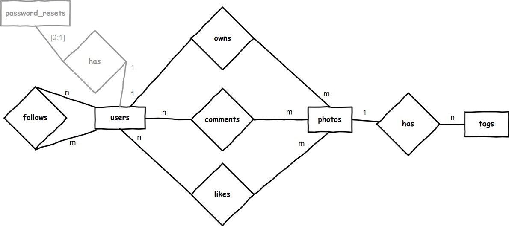
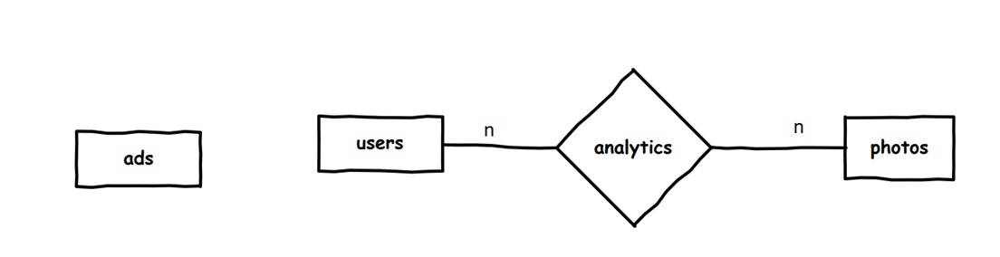

# ERM

Welche Entitäten mit welchen Attributen bereits im Hub enthalten sind wird jeweils unter der SQL-Eingabe angezeigt.

## ERM für den Betrieb des sozialen Netzwerks

Zur besseren Übersicht wurden im obigen ERM die Attribute weggelassen. Es handelt sich um folgende:

| Entität             | Attribute                                                    |
| ------------------- | ------------------------------------------------------------ |
| **users**           | id, username, email, password, name, bio, gender, birthday, city, country, centimeters, avatar, role, is_active, remember_token, created_at, updated_at |
| **photos**          | id, user_id, description, url, created_at, updated_at        |
| **tags**            | id, photo_id, name, created_at, updated_at                   |
| **likes**           | id, photo_id, user_id, created_at, updated_at                |
| **follows**         | id, following_id, follower_id, created_at, updated_at        |
| **comments**        | id, user_id, photo_id, body, created_at, updated_at          |
| **password_resets** | email, token, created_at                                     |

Die Spalten ` created_at ` und `updated_at` werden vom System automatisch mit den entsprechenden Zeitstempel befüllt. In SQL-Ausdrücken verwendet man dafür einfach `now()`. Die Tabelle `password_resets` dient dazu zu prüfen, ob der Nutzer berechtigt ist ein Passwort zurücksetzen zu dürfen. 

## ERM zum Betreiben des sozialen Netzwerks

Zur besseren Übersicht wurden im obigen ERM die Attribute weggelassen. Es handelt sich um folgende:

| Entität       | Attribute                                                    |
| ------------- | ------------------------------------------------------------ |
| **ads**       | id, priority, name, type, url, img, query, created_at, updated_at |
| **analytics** | id, ip, device, brand_family, brand_model, browser_family, browser_version, platform_family, platform_version, user_id, photo_id, created_at, updated_at |

In der Tabelle `analytics` wird vom System protokolliert, welcher Benutzer sich welches Photo in der Detailansicht angesehen hat. In der `ads`-Tabelle können einzelne Werbeanzeigen geschaltet werden.

