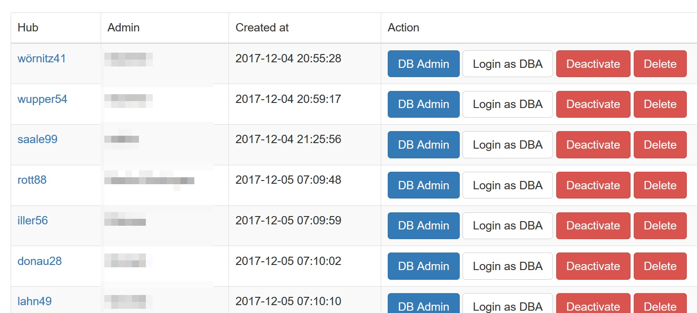
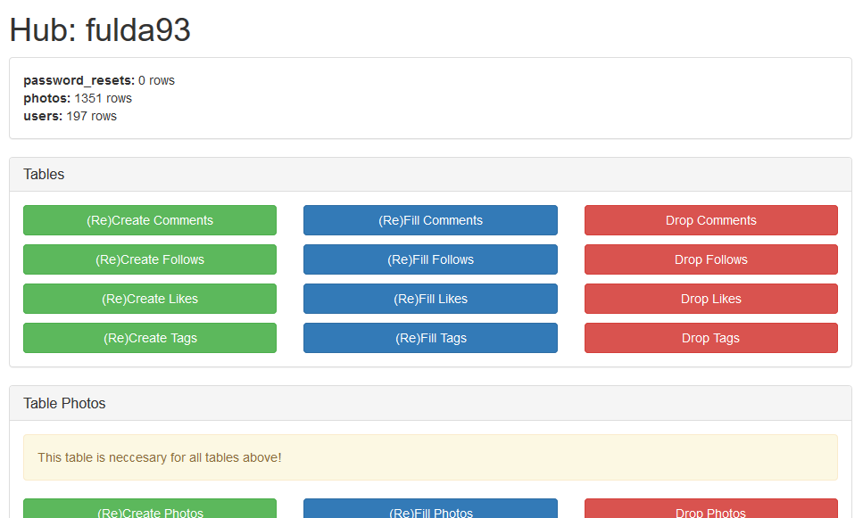
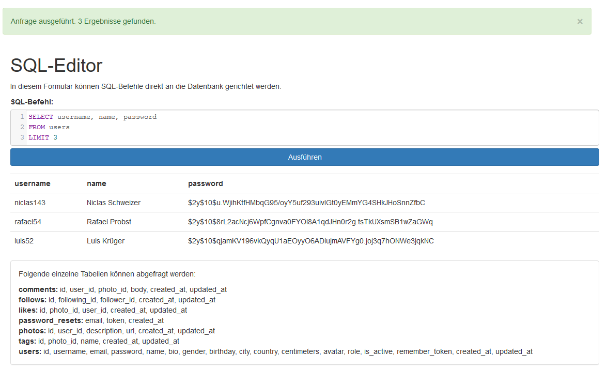

# Bedienung

## instahub.org

Die Hauptseite des Projektes ermöglicht es sich als interessierter Besucher zu informieren. Bei Interesse können hier:

* Ein Lehreraccount erstellt werden (Registrieren)
* Sich mit einem Lehreraccount angemeldet werden (Anmelden)
* Ein InstaHub erstellt werden (Erstelle deinen InstaHub)

Um sich als Lehrer zu registrieren, muss ein Account angelegt werden. Dabei sind Daten wie das Geburtsdatum oder die E-Mail-Adresse freiwillig. Letztere muss aber angegeben werden, wobei nicht auf deren Gültigkeit geprüft wird. 

Um einen Lehreraccount zu aktivieren, [senden](https://wi-wissen.de/contact.php) Sie mir mir dafür den von Ihnen gewählten Benutzernamen und einen geeigneten Nachweis, dass ein Lehrer (und kein Schüler) sind.

Ein InstaHub kann nur angelegt werden, wenn dieser einem Lehrer zugeordnet wird. So ist sichergestellt, dass zum einen unter fachkundiger Anleitung ein Lernerfolg erzielt werden kann. 

Wurde einer Lehrkraft ein InstaHub zugeordnet, so muss dieser ebenfalls erst aktiviert werden. Dies kann durch die Lehrkraft selbst durchgeführt werden.

### Verwaltung der Instahubs

Nach dem erfolgreichen Login mit einem Lehrer Account wird eine List mit allen zugeordneten hab's angezeigt. Folgende Aktionen sind möglich:

 * Aktivieren – Erst hierdurch wird der Instahub aktiviert.

 * DB Admin – siehe Verwaltung eines InstaHub

 * Login as DBA – Hierdurch wird der Lehrer auf den ausgewählten InstaHubweitergeleitet und loggt sich automatisch - ohne Kenntnisse desBenutzerkennwortes - als der erste DBA-Benutzer ein. Dies ist in der Regel derSchüler Account.

 * Deaktivieren – Hier kann ein InstaHub deaktiviert werden

 * Delete – Hier kann der InstaHub mitsamt der gesamten Datenbank nachBeendigung der Lerneinheit vollständig gelöscht werden. (Achtung: Hierfür istkeine Bestätigung erforderlich.) 

Login as DBA - Hierdurch wird der Lehrer auf den ausgewählten InstaHub weitergeleitet und loggt sich automatisch - ohne Kenntnisse des Benutzerkennwortes - als der erste DBA-Benutzer ein. Dies ist in der Regel der Schüler Account.

Delete - Hier kann der Instahub mitsamt der gesamten Datenbank vollständig gelöscht werden. (Achtung: Hierfür ist keine Bestätigung erforderlich.) 

### Verwaltung eines Instahubs

Im oberen Bereich werden alle aktuell verfügbaren Tabellen mit der Anzahl aller Zeilen angezeigt.

Darunter befinden sich kopiert alle Tabellen es sind jeweils folgende Aktionen möglich:

* (Re)Create - Hierdurch wird die Tabelle ohne Einträge neu angelegt.
* (Re)Fill - Hierdurch wird die Tabelle mit Dummyeinträgen neu angelegt
* Drop - Hier drüber wird die Tabelle vollständig gelöscht.

Üblicherweise ist diese Hilfestellung Für Schüler notwendig, die einen Fehler gemacht haben, nicht mitgekommen sind oder krank waren.

Sicher ist Ihnen schon aufgefallen, dass das Löschen etwa der Tabelle *Photo* kritisch sein sollte, da dadurch ja etwa die darauf aufbauende Tabelle *Like* ebenfalls gelöscht werden sollte. Dies wird hier aber absichtlich unterbunden, indem das Ausführen von Constraints ausgesetzt wird. 

Dadurch ist es möglich auch zu einem späteren Zeitpunkt die Tabelle *Photo* neu aufzubauen, ohne dass bisherige Errungenschaften in den darauf aufbauenden Tabellen vernichtet werden. Natürlich können dadurch Inkonsistenzen in der Datenbank entstehen, welche aber nicht zu einem Absturz des Systems führen werden. Ist es dennoch notwendig diese Inkonsistenzen aufzulösen, so kann dies entweder manuell geschehen oder die abhängigen Tabellen werden ebenfalls neu aufgebaut.

## *hub*.instahub.org

Wird der Hauptdomain der InstaHub Name vorangestellt, so befindet sich der Benutzer in seinem eigenen InstaHub. Jeder InstaHub funktioniert vollkommen unabhängig von allen anderen InstaHub.

Ein InstaHub ist von der Funktion her an das soziale Netzwerk Instagram angelehnt. So ist es möglich Fotos hoch zu laden und mithilfe des Hashtag-Zeichens # zu verschlagworten ebenfalls können Fotos kommentiert und geliked werden: 

Interessanten Mitgliedern des sozialen Netzwerkes kann gefolgt werden, sodass sich ein individueller Newsfeed für jeden Benutzer bildet. Ein Benutzer besitzt zur Eigenpräsentation eine Profilseite:

Die Besonderheit des sozialen Netzwerkes sind hier seine zwei Rollen:

* User - Dies sind alle regulären Benutzer des sozialen Netzwerkes. Ähnlich wie es der Schüler auf seinen sozialen Netzwerken wie etwa Facebook oder Instagram ist
* DBA - hier hat der Schüler zusätzliche Rechte: Dazu zählt etwa fremde Bilder und Kommentare zu löschen. Fremde Profile zu editieren (und damit auch das vollständige Geburtsdatum und E-Mail zu sehen) und der Menüeintrag Database

### Database

Hier findet die eigentliche Besonderheit des eigenen InstaHubs statt: Es ist möglich mit SQL-Befehlen die Datenbank nach Belieben zu verändern. Ergebnisse werden dabei Übersicht präsentiert:

