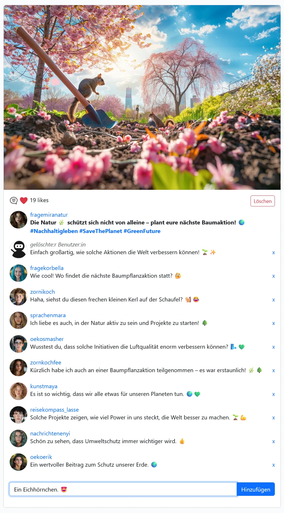
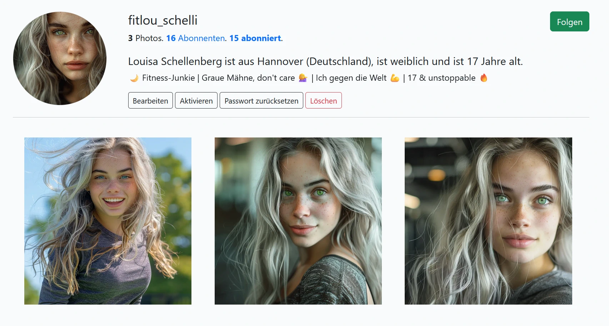

# *hub*.instahub.org

Wird der Hauptdomain der InstaHub Name vorangestellt, so befindet sich der Benutzer in seinem eigenen InstaHub. Jeder InstaHub funktioniert vollkommen unabhängig von allen anderen InstaHub.

Ein InstaHub ist von der Funktion her an das soziale Netzwerk Instagram angelehnt. So ist es möglich Fotos hoch zu laden und mithilfe des Hashtag-Zeichens (`#`) zu verschlagworten, mit dem `@`-Zeichen können Nutzer verlinkt werden. Ebenfalls können Fotos kommentiert und geliked werden: 

Interessanten Mitgliedern des sozialen Netzwerkes kann gefolgt werden, sodass sich ein individueller Newsfeed für jeden Benutzer bildet. Ein Benutzer besitzt eine Profilseite mit seinen Photos:

Die Besonderheit des sozialen Netzwerkes sind hier seine zwei Rollen:

* `User` - Dies sind alle regulären Benutzer des sozialen Netzwerkes. Ähnlich wie es der Schüler auf seinen sozialen Netzwerken wie etwa Facebook oder Instagram ist.
* `DBA` - hier hat der Schüler zusätzliche Rechte: Dazu zählt etwa fremde Bilder und Kommentare zu löschen. Fremde Profile zu editieren (und damit auch das vollständige Geburtsdatum und E-Mail zu sehen) und der Menüeintrag Database
