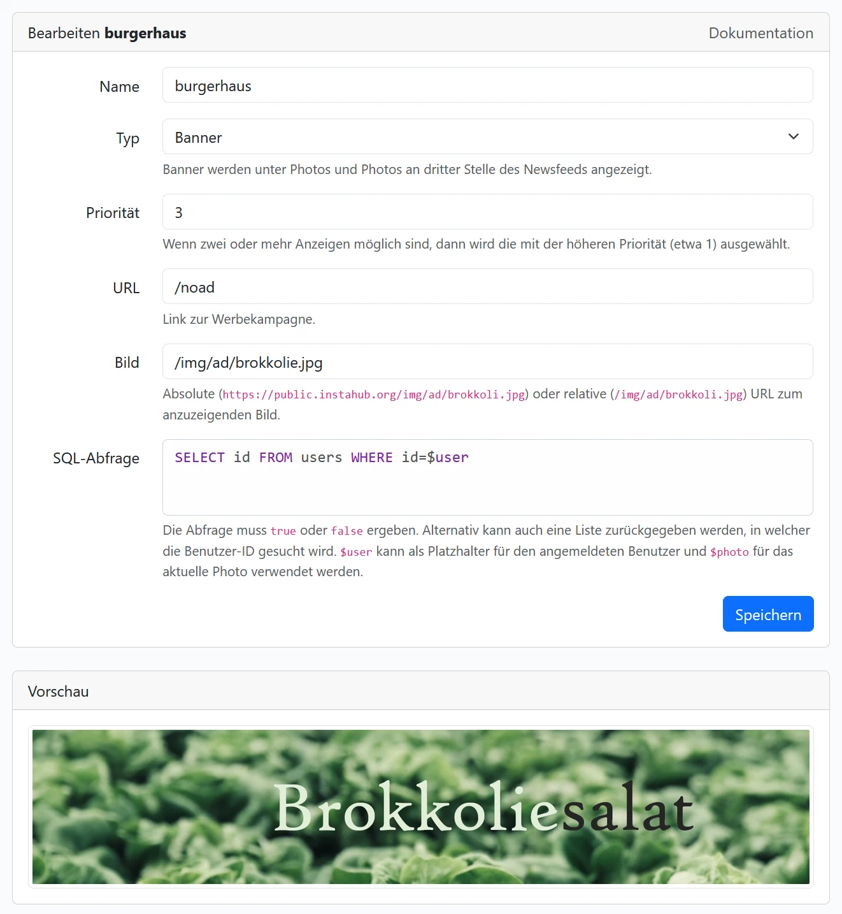

# personalisierte Werbung

Wie finanzieren sich soziale Netzwerke? Und warum ist Werbung oft so passend? Das lernst du hier.

## Einstellungen

Mit der Tabelle `ads` aktiviert InstaHub die Werbeanzeigen. Alle mitgelieferten Anzeigen sind selbstverständlich frei erfunden. Werbung vom Typ `banner` wird auf den einzelnen Photoseiten:


und vom Typ `photo` als dritter Eintrag im Newsfeed angezeigt:


Werbeanzeigen werden dabei personalisiert ausgeliefert. Wie diese geschieht, kann mit SQL-Kenntnissen oder der graphischen Suche beim Erstellen der Anzeige selbst bestimmt werden:



Je kleiner die Zahl bei `Priorität` ist, desto wichtiger ist die Anzeige und wird eher geprüft.

Als Bild kann eine der Beispielanzeigen verwendet werden, ein selbst hochgeladenes Photo, oder wenn die Erlaubnis vorliegt, auch ein Bild von einem anderen Server.

Um zu prüfen, ob die Anzeige angezeigt werden soll, wird die `SQL-Abfrage` ausgeführt. Diese kann entweder selbst geschrieben und im SQL-Editor ausprobiert oder über die graphische Suche erstellt werden.

So wird das Ergebnis interpretiert:

## Einfache Bedingungen

Es wird geprüft, ob die `id` des Nutzers oder des Photos im Ergebnis enthalten ist. Bei Werbeanzeigen vom Typ `banner` wird nach der `id` des Photos und beim Typ `photo` nach der `id` der Nutzer:in gesehen. Dabei wird zuerst die Spalte `user_id` bzw. `photo_id`  und wenn diese nicht vorhanden sind in der Spalte `id` nachgesehen.

```sql
# Werbeanzeige vom Typ `photo` nur für männliche Nutzer.
SELECT id
FROM users
WHERE gender = 'male'
```

```sql
# Werbeanzeige vom Typ `banner` nur für Photos mit 'wasser' in der Beschreibung.
SELECT id # wichtig, dass kein `*` genommen wird
FROM photos
WHERE description LIKE '%wasser%'
```

```sql
# Werbeanzeige nur für männliche Nutzer.
SELECT id as `user_id`
FROM users
WHERE gender = 'male'
```

## Bedingungen mit Platzhalter

Mit Platzhaltern kann die Anfrage so eingeschränkt werden, dass nur noch geprüft wird, ob es überhaupt ein Ergebnis gibt. Beim Typ `photo` kann hier der Platzhalter `$user`  für die aktuelle Nutzer:innen-ID und beim Typ `banner` der Platzhalter `$photo`  für die aktuelle Photo-ID verwendet werden.

```sql
# Werbeanzeige für Nutzer:innen, die mindestens einen Kommentar geschrieben haben.
SELECT *
FROM comments
WHERE user_id = $user
```

```sql
# Werbeanzeige vom Typ `banner` deren Photo mindestens einen Like erhalten hat.
SELECT *
FROM likes
WHERE photo_id = $photo
```

```sql
# Werbeanzeige wird immer angezeigt.
SELECT id FROM users WHERE id=$user
```

**Case**: Mit dem SQL-Schlüssel `CASE` können Spaltenwerte etwa in `true` und `false` umgewandelt werden. Wenn ein Platzhalter verwendet wird und das Ergebnis aus genau einer Zelle (eine Zeile und eine Spalte) besteht, dann wird diese auf Wahrheit geprüft.

```sql
# Werbeanzeige für Nutzer:innen, die beim zuletzt angesehen Bild mit einem PC/Laptop auf der Seite waren.
SELECT 
    CASE 
        WHEN device = 'desktop' THEN true 
        ELSE false 
    END 
FROM analytics
WHERE user_id=$user
ORDER BY id DESC
LIMIT 1
```

## Werbeblocker

Kann Werbung nicht angezeigt werden, wird ein Hinweis angezeigt. In diesem Fall nutzt dein Browser einen Adblocker wie etwa [uBlock Origin](https://de.wikipedia.org/wiki/UBlock_Origin). Eine Filterung im Schulnetzwerk ist eher unwahrscheinlich, da die fiktiven Anzeigen ja vom selben Server kommen.

Bei größeren SchülerInnen kann auch die Funktion eines [Anti-Adblock Killers](https://github.com/reek/anti-adblock-killer#anti-adblock-killer--reek) besprochen werden. Dieser unterdrückte nämlich zuerst die hier [implementierte Lösung](https://stackoverflow.com/a/20505898), um die Warnanzeige zu umgehen. Diese ist so weit oben bei Google zu finden, dass der Skript einfach auf Verdacht `var canRunAds = true;` in die Webseiten injected. Daher habe ich die Variable auf einen zufälligen Namen geändert und schon klappte es wieder. Das kann natürlich auch ausgehebelt werden, aber dafür müsste dies individuell für die Seite gemacht werden. Sehr schwer wird es, wenn ich den Variablennamen serverseitig jedes Mal neu auswürfeln würde. Dann könnte man das `div`-Element mit einer speziellen CSS-Regel ausblenden oder mit JavaScript löschen, wodurch ich auch dessen `id` ändern müsste. Jetzt müsste man das Element anhand des CSS-Pfades bzw. XPath suchen, wodurch ich die Position variieren müsste. Du erkennst wohin die Reise geht?